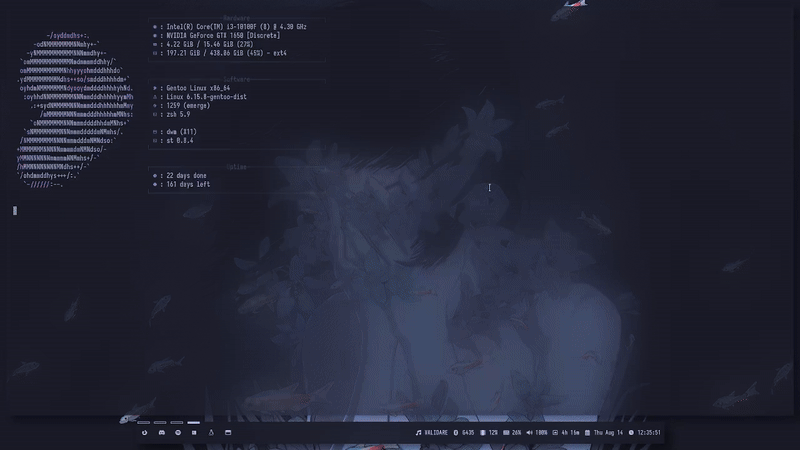

<h1 align="center">Suckless</h1>

My tokyonight theme suckless utils!

##

## Requirements / Dependencies
* Arch
`sudo pacman -S xorg-server xorg-xinit xorg-xrandr xorg-xrdb libx11 libxft libxcb libxinerama imlib2 harfbuzz`
* Gentoo
`sudo emerge -va xorg xorg-drivers libX11 libXft libXcb libXinerama freetype fontconfig harfbuzz`
* Debian
`sudo apt install libxcb-res0-dev libx11-xcb-dev libx11-dev libxcb1-dev libxinerama-dev libfontconfig1-dev libxft-dev`
##

## Installation
`git clone https://github.com/zakky20/suckless.git`
##
`cd suckless/dwm && sudo make install`
##
`cd suckless/dmenu && sudo make install`
##
`cd suckless/st && sudo make install`
##
`cd suckless/slstatus && sudo make install`
##
`cd suckless/slock && sudo make install`
##

## License
This project is licensed under [GPL-3.0](https://raw.githubusercontent.com/Illumina/licenses/master/gpl-3.0.txt).
